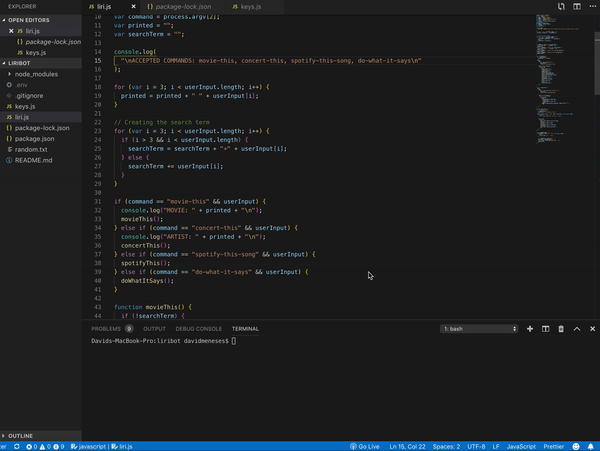
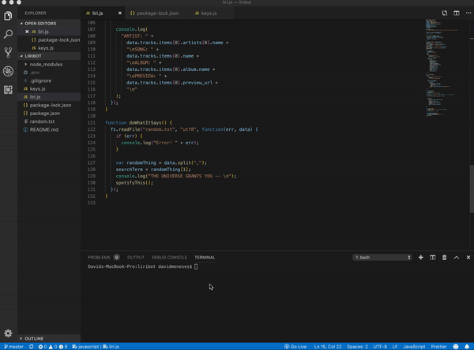
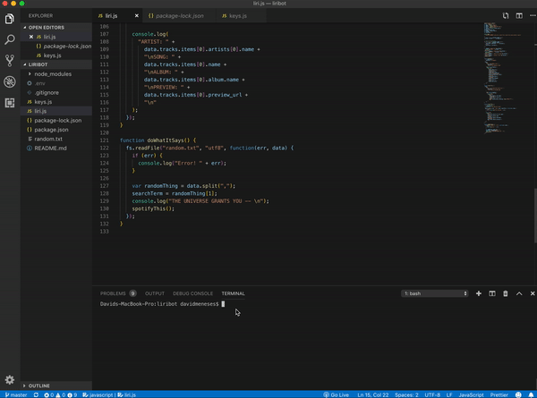
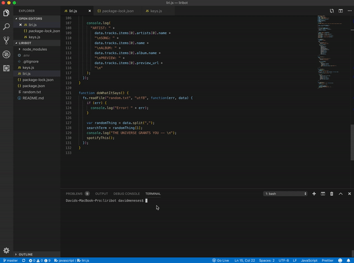

# liribot

Liri is a Language Interpretation and Recognition Interface. It takes in parameters in the command line from the user and gives data back.

## The commands that Liri can recognize are:

- concert-this
- spotify-this-song
- movie-this
- do-what-it-says

## Technologies Used

- Node.js
- Javascript
- NPM Packages:
  - Axios
  - Node-Spotify-API
  - Moment
  - DotEnv

## How to Operate Liri

You will be typing all commands into the command line and all results will be displayed in the terminal. The user does not need to worry about casing when searching for information.

1. Install all associated NPM packages.
2. Run the page with "node liri.js" to see the parameters Liri can take.

3. Next we use node "liri.js concert-this 'artist's name'" to search for the next 3 conerts that the artist is playing. I search for Anderson Paak and we see the names of the venues, the locations, and dates of the next 3 concerts.
4. Use "node liri.js spotify-this-song 'song name'" to search the Spotify API for the song's artist, title of the song, ablum it is on, and a link to a preview of the song. If the user only runs "liri.js concert-this" and does not include any song data information for The Sign by Ace of Base is displayed.

5. When the user runs "node liri.js movie-this 'movie name'" the title, release year, IMDB rating, Rotten Tomatoes rating, countries the movie was produced in, languages it is offered in, plot of the movie, and actors in the movie are displayed. If no movie is specified the movie Mr. Nobody will displayed with it's relevant information.

6. Lastly, when a user types in "node liri.js do-what-it-says" it pulls up the spotify-this-song information for the song I Want It That Way by the backstreet boys. This information is stored in the random.txt file and if grabbed using the fs node package.

Liri is a great tool to quickly find basic information on musicians, actors, movies, songs, and concerts. PLease use it to help you find information quickly for your favorite things!

## Author

David Meneses
